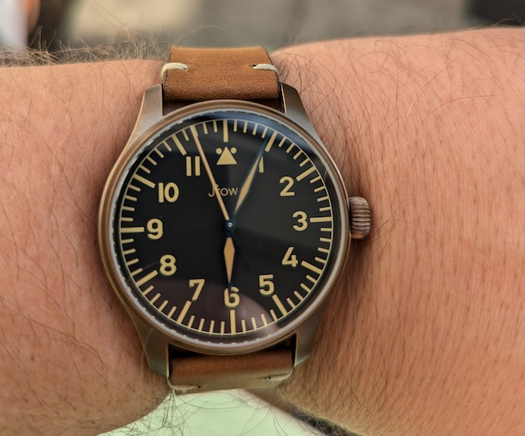

I've been collecting watches for 10 years now there's something about them that really appeals to me. I rarely ever show them off they're quite a personal part of me and each watch has it's own story. For reasons that most watch collectors will understand (even if they don't practice) I have strict rules on purchasing watches:

1. I can only own ~~6~~ ~~7~~ 8 at a time.
2. No watch over £2000 (Moonwatch will break this eventually)
3. The watch must either be automatic/solar/kinetic

The only rule I've struggled with is 1, letting go of a watch is always hard and it's like letting a piece of me go, apart from the Samsung Galaxy watch 5, that thing sucked and I'm not a fan of smart watches.

In no particular order:

## Stowa Ikarus

This has just recently passed it's 10 year birthday. I bought it around the time I got engaged so it's become my engagement watch, it was going to be my wedding watch (my dad did the same) but my partner convinced me to get a ring instead. This is a pretty interesting watch, when Stowa first released them they didn't come with an onion crown I had to ask for this especially. They'd later start including the onion crown on all future versions. It also has their "upgraded" movement which looks stunning. It's quite a classy watch and goes with formal wear if I ever have the occasion to wear a suit (never).

## Stowa Flieger Classic 40

This is the watch I really wanted when I got the Ikarus but I couldn't afford it. I finally pulled the trigger last year to celebrate finishing 2 shitty jobs and moving onto my latest role. Me and my partner have an inside joke that it's the watch that `$work` bought. I absolutely adore this watch you can wear it with anything and easily get lost in the dial. Even though it was bought around the time when things weren't great it'll always be something I'm proud and happy to wear. The black dial is really something else, it just looks good in any weather. If it's been sunny while wearing it outside the lume on the dial is super bright, it usually lasts about 2-3 hours.

My only criticism is the Stowa logo on it, I was unlucky enough to buy this just before they switched back to their old and arguably better logo. Still it's an awesome watch and is currently on my wrist while writing this.

> We're a Stowa family, a few years after I bought the Ikarus my brother bought a Marine and not long after that my dad bought a limited edition Marine Blue Automatik as a birthday present for himself.

## Casio G-Shock GW-M5610U-1ER

This is my first G-Shock and first solar watch. It's an amazing looking piece, it's not huge and in your face like other G-Shocks, I've knocked it around a fair bit when doing work around the house or in a data centre. It's traveled with me on cruises and always kept the correct time. I love it for just how indestructible it is. The only reason I knew this existed was because at the time an ex-colleague showed me the [Bamford](https://g-shock.co.uk/gw-m5610bwd20-1er) version (I still want it but refuse to pay what it's going for now) but it was out of stock everywhere. If you're looking for a cheap and practical watch then this is for you.

## Casio G-Shock GW-M5610U-1BER

This is the "inverted" version of the 1ER. It's difficult to read without the backlight and I absolutely love it. Both the 1ER and 1BER often go on sale for 20/30% off on Amazon so if you keep an eye out then you can get a bargain.

## Christopher Ward C60 Trident Pro 300

Don't drink and buy watches folks! Not quite as bad as that but I'd had my eye on a diver for a while and showed my wife it when we were out and about and we both agreed it was a stunning watch. A few drinks later and I bought it. I don't wear this anywhere near as much as I should, it's one of the few watches I own that you have to coordinate your clothes with. The trident on the seconds hand is a really nice touch and goes to show how much such a little thing really can set a watch off.

## Seiko SRPD79K1

This is quite an interesting watch, those that follow the cheaper end of the watch market will instantly recognise that it's a Seiko 5, there are lots of versions of this watch out there and you can usually pick one up quite cheap. I don't really wear this anymore, it's an ok watch but the outer ring is mis-aligned (a common problem) which bugs me. My intention for this watch is to take it apart and have a go at modding it. I like the idea of making it into a cheap Snoopy or replacing the hands with white/yellow hands. I've never gotten around to opening it up and taking it apart but will do at some point. It's also worth noting that this thing keeps terrible time, it's off by at least 10 seconds a day.

## Stowa Bronze Flieger

I promised myself no more watches but this just jumped out at me. It's very classy and sophisticated. I find the crown very stiff to wind which is a bit odd but other than that it's just amazing to wear. I guess this could be classed as the watch that `$work` (2.0) bought. I don't think I could recommend this watch to people though, it's an extravagance for me, I probably shouldn't have bought it but it looks so good!

## Timex Expedition Solar

A complete random purchase after seeing it on sale on Amazon US for £40, yup a whole £40! Such a bargain for a solar powered watch. This is my first watch of this style and I really like the 24 hours sub numbers. I'm really impressed with the lume on this as well, while it doesn't last too long it is bright. Amusingly because of the british weather it did take a while and my torch to get this fully charged so I could wear it properly. I've heard that Timex are supposed to be quite loud but this is fine, only slightly louder than my Stowas but not enough to cause an issue.
